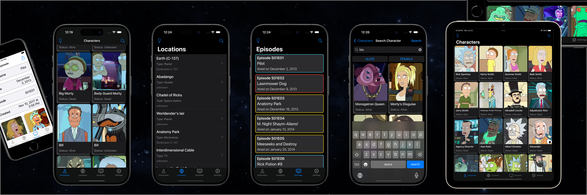

# Rick and Morty App
   



Welcome to the Rick and Morty App! This application provides an interface to explore characters, locations, and episodes from the popular TV show "Rick and Morty".

## Table of Contents

- **[Features](#features)**
- **[Requirements](#requirements)**
- **[Installation](#installation)**
- **[Usage](#usage)**
- **[Architecture](#architecture)**
- **[Contributing](#contributing)**
- **[License](#license)**
- **[Contact](#contact)**

## Features

- **Browse Characters**: View detailed information about all the characters.
- **Explore Locations**: Discover different locations featured in the show.
- **Episodes Overview**: Get information about each episode.
- **Search Functionality**: Search for characters, locations, or episodes.
- **Theming**: Toggle between dark and light mode.

## Requirements

- **Xcode**: 15.0.1 or newer (Recommended)
- **iOS**: 15.0+
- **Swift**: 5.0+

## Installation

1. Clone the repo:
    ```sh
    git clone https://github.com/AndreiShpartou/RickAndMorty.git
    ```

2. Navigate to the project directory:
    ```sh
    cd RickAndMorty
    ```

3. Open the project in Xcode:
    ```sh
    open RickAndMorty.xcodeproj
    ```

## Usage

1. Run the app on a simulator or physical device:
    - Select the desired target device.
    - Press `Cmd + R` to build and run the app.

2. Use the tab bar to navigate between characters, locations, episodes, and settings.

3. Use the search feature to quickly find specific characters, locations, or episodes.

## Architecture

The app is built using the **MVVM-C** architecture pattern to ensure a clean and scalable codebase.

## Contributing

Contributions are welcome!
If you find any bugs or have suggestions for improvement, please create an issue or submit a pull request

## License
The data and images are used without claim of ownership and belong to their respective owners.
Distributed under the MIT License. See `LICENSE` for more information.

## Contact

[AndreiShpartou@gmail.com](mailto:AndreiShpartou@gmail.com)
